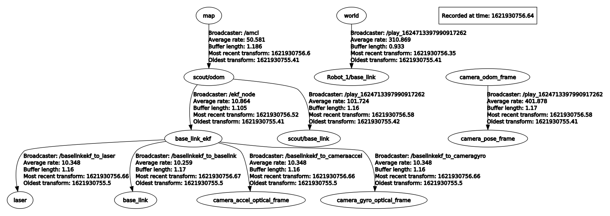
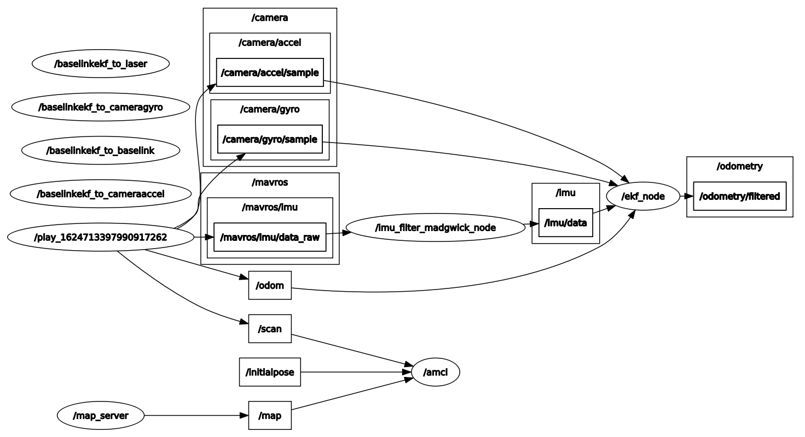
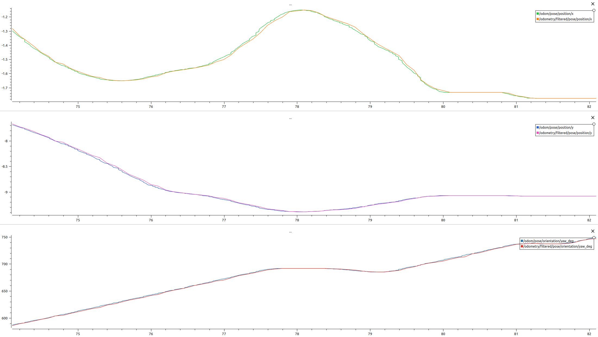
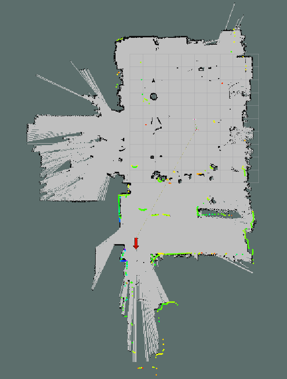
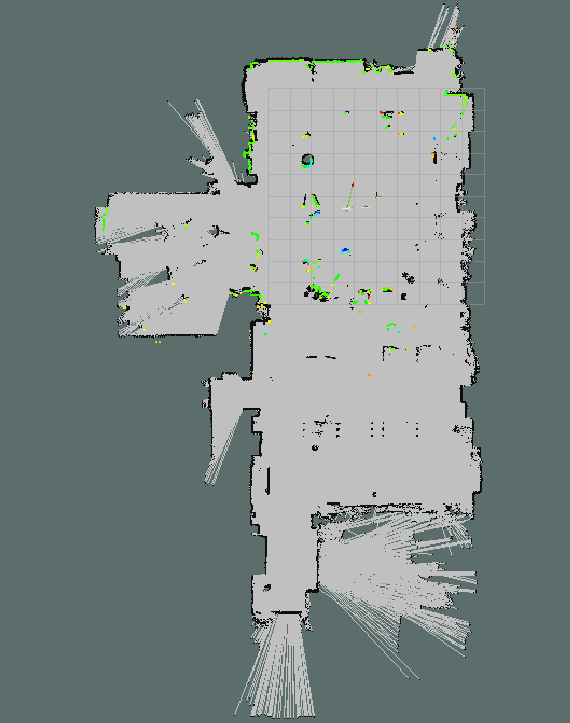

# Scout SLAM


Second project for the Robotics course at Politecnico di Milano, A.Y. 2020/2021.


***


## General details

[Scout 2.0](https://www.agilex.ai/index/product/id/2) is an indoor and outdoor mobile platform, dedicated to the development of multiple applications in higher education, research and industry.

In this project we are given some recorded data, such as the odometry provided by the manufacturer and other data from the following robot sensors:
- *OptiTrack* tracking system, which publishes the pose of the robot in the `/Robot_1/pose` topic;
- *SICK LMS100* lidar, which publishes the laser data in the `/scan` topic;
- *Intel T265* camera, which publishes the visual odometry in the `/camera/odom/sample` topic and the IMU data in the `/camera/accel/sample` and `/camera/gyro/sample` topics;
- *Pixhawk mini* IMU, which publishes the IMU data in the `/mavros/imu/data_raw`.

Using Robot Operating System (ROS) we have pursued are the following goals:
- create of a map from the recorded data above;
- fuse different data sources using *robot_localization* package;
- localize the robot using *amcl* package and *robot_localization* package.


***


## Structure of the project

```text
scout_slam
└── src
    └── project2
        ├── CMakeLists.txt
        ├── launch
        │   ├── localization.launch
        │   └── map_creation.launch
        ├── maps
        │   ├── map.pgm
        │   └── map.yaml
        ├── package.xml
        ├── params
        │   ├── amcl_params.yaml
        │   └── ekf_params.yaml
        ├── plotjuggler
        │   └── odom_comparison.xml
        └── rviz
            ├── localization.rviz
            └── map_creation.rviz
```


***


## Description of the files

| File | Description |
| :--- |:--- |
| localization.launch | ROS launcher file performing the following tasks: creation of static transformations related to `base_link_ekf` frame, startup of *imu_filter_madgwick* to filter IMU data; startup of *ekf_localization_node* from *robot_localization* package to fuse different sources of odometry and IMU values, startup of *amcl* node to localize the robot in the map, startup of *map_server* to publish the map, startup of an *rviz* node to visualize two different odometries. |
| map_creation.launch | ROS launcher file performing the following tasks: creation of a static tf of 90 degrees from `scout/base_link` to `laser` to correct the misalignment between the laser and the robot, startup of *gmapping* node to create the map, startup of an *rviz* node to visualize the map and laser data. |
| map.pgm | Image of the map created by *gmapping*. |
| map.yaml | Yaml configuration file containing information about the map. |
| amcl_params.yaml | Yaml configuration file containing all the parameters to make *amcl* work as good as possible. |
| ekf_params.yaml | Yaml configuration file containing all the parameters to make *ekf_localization_node* work as good as possible. |
| odom_comparison.xml | *Plotjuggler* configuration file showing the differences between `scout/odom` and the `odometry/filtered`, displaying the *x*, the *y* and the *yaw* value for each odometry in three different subplots. |
| localization.rviz | *Rviz* configuration file containing the settings to show the position of the robot in the map. |
| map_creation.rviz | *Rviz* configuration file containing the settings to show the map during the creation phase. |


***


## TF tree

We implemented static transformations to link frames that are fixed to the robot: `base_link_ekf` is the robot base frame, `base_link` is the *pixhawk mini* IMU frame, `camera_accel_optical_frame` and `camera_gyro_optical_frame` are the camera IMU frames.

We also implemented a static tf (`baselinkekf_to_laser`) inside both *localization.launch* and *map_creation.launch* to move from the `base_link_ekf` frame to the `laser` frame. In such a way we can perform the localization using the laser data with respect to the `base_link_ekf` frame.

In *localization.launch* we implemented a static tf between `base_link_ekf` and `base_link`, `camera_accel_optical_frame` and `camera_gyro_optical_frame`.  

Other two transformations that get generated are the following:
- `amcl`, which is published by the *Adaptive Monte Carlo Localization* node, linking `map` to `scout/odom`;
- `ekf_node`, which is published by the *Robot Localization* node, linking `scout/odom` to `base_link_ekf`.

In the image below the complete TF tree is shown:




***


## How to start and use the nodes

Given the three bag files, we decided to use *1.bag* in order to create the map, then *2.bag* and *3.bag* to perform localization on that map.

Compile with *catkin*:
```console
catkin_make
```

If you want to see the process of the creation of the map:
```console
roslaunch project2 map_creation.launch
rosbag play --clock 1.bag
```

If you want to perform the robot localization:
```console
roslaunch project2 localization.launch
rosbag play --clock 2.bag
```

In addition, if you want, you can see the values of *x*, *y* and *yaw*  shown in three different *plotjuggler* subplots; this way it is possible to compare the two odometries `/scout/odom` and `/odometry/filtered`:
```console
rosrun plotjuggler plotjuggler --layout ./src/project2/plotjuggler/odom_comparison.xml
```


***


## Sensors choice

In the `ekf_node` we chose to use one odometry sensor, one IMU sensor and two IMU camera sensors. We decided to not consider the camera odometry because the ekf node performed worse with it. This setup gave us the best results in the odometry comparison on *plotjuggler*.

The odometry sensor is published on the `/odom` topic and it is the odometry computed starting from the wheel encoders. For the IMU sensors we used *pixhawk mini* data published on the `/mavros/imu/data_raw` and two IMU sources from the *Intel T265* published on `/camera/accel/sample` and `/camera/gyro/sample`. *Pixhawk mini* data were pre-processed by `imu_filter_madgwick_node`, which publishes filtered data on the `/imu/data` topic.

For each sensor in the `ekf_node` we must specify which variables the filter will consider, following this order: *X*, *Y*, *Z*, *roll*, *pitch*, *yaw*, *dX/dt*, *dY/dt*, *dZ/dt*, *droll/dt*, *dpitch/dt*, *dyaw/dt*, *d2X/d2t*, *d2Y/d2t*, *d2Z/d2t*. For the odometry sensor we considered only 2d variables, so *Z*, *roll*, *pitch*, *dZ/dt*, *droll/dt*, *dpitch/dt* and *d2Z/d2t* are set to false. Also *d2X/d2t* and *d2Y/d2t* are false because we don't have acceleration fields in the odometry message. 
 
For the IMU sensors we have no information about the position and the linear velocity of the sensor, so *X*, *Y*, *Z*, *dX/dt*, *dY/dt* and *dZ/dt* are set to false. Since we are considering only 2d variables *roll*, pitch*, *droll/dt*, *dpitch/dt* and *d2Z/d2t* are set to false.
 
As a consequence of considering the same variables for the three IMU sensors, we have to set the differential parameter of two of them (*imu0* and *imu1*) to true.


***


## Others

In the following image you can see the relationship between the nodes from a publisher/subscriber perspective:

  

Below it is shown the difference between the two odometries published on `scout/odom` and `odometry/filtered` topics.
In the first subplot you can see the *x* coordinate of the robot, in the second one its *y* coordinate and in the third one the *yaw* value.
The filtered odometry is similar to the manufacturer odometry but they are not identical since the former takes into account both `scout/odom` and the correction taken from IMU data.



These last two images are taken from the *map_creation* rviz instance and from the *localization* rviz instance:






***


## Group members

- Leonardo Gargani
- Alberto Maggioli
- Lorenzo Poretti

